## DES222: Assessment 2
#### Aaron Troughton, 1167270 ####
# Journal Title: ‘Location Based Diary’ #

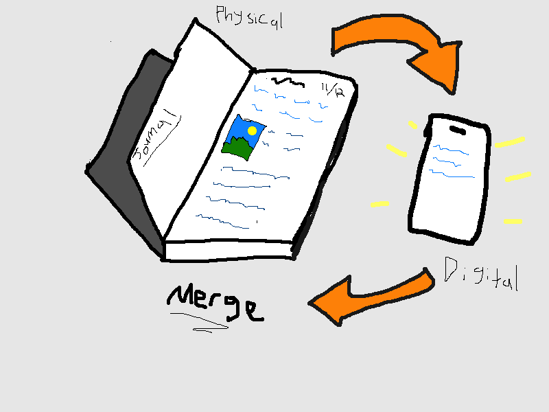

## Index: ##
**1. CONCEPTUALISATION**

1.1	Task and Journal Statements

1.2	Determining Design Purpose

1.3	Research and Evaluation of Existing Solutions

1.4	Early Concepts

1.5	Development of Selected Concept

**2. Front End Programming**

2.1 Home Page Layout

2.2 Designing the Journaling User Interface

**3. Geolocation and API**

**4. Backend support with Flask**

***
# 1. Conceptualisation # 

02/10/2024
## 1.1 Task and Journal Statements ##
<ins> Predetermined Goal:</ins> Create a context aware web application to enhance user experience through responsiveness and innovation 

The task prescribed is to design and develop a responsive project. The following journal will display how ideas and concepts evolve from the predetermined goal and through evaluation of existing projects contribute to the creation of the final design.

***
## 1.2 Determining Design Purpose ##
As the project is aimed to enhance user experience through a context-aware application it is evident that the Design Council’s Double Diamond methodology will be used to ensure human centred design factors are addressed throughout the tasks design development.


Design Council. (n.d.). Framework for innovation. https://www.designcouncil.org.uk/our-resources/framework-for-innovation/

In 2024 there has been a growing movement of digital detox through applications like BeReal with a focus on showing the world unfiltered, switching to 'dumb phones', eliminating distractions, and connecting back to nature. Although it may seem contradictory at first, this concept will be core to the development of this project by prioritising simplicity and disconnection.

#### <em> “Travel far enough, you meet yourself" - David Mitchell, Cloud Atlas (2004) ####

<strong> Rationale </strong> - The goal and expected outcome for this project's application to achieve by the end of the design process would be to support a healthier relationship with technology in everyday life by embracing digital wellbeing, promoting mindfulness, as well as presenting moment awareness through the simplicity of an adaptive journal to store meaningful experiences. 

A concept proposal posted of Padlet was created from this rationale as well as a picture collage to brainstorm the aesthetic and functionality of the application.

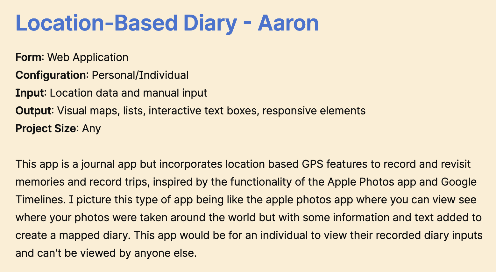


***
## 1.3 Research and Evaluation of Existing Solutions ##

03/10/2024

With the rationale and core concepts defined prior in section 1.2 of this journal, it sets up criteria to evaluate existing solutions to identify strengths and weaknesses through SWAT analysis to contribute to the development of this project. The collage above visualises the brainstorming process powering the projects idea by merging certain features and functionality from various applications such as timeline tracking, and adding interactive media with the goal of creating a digital journal to authentically preserve how someone felt about a certain day or journey. The collage incorporating varying solutions offers a mixture of different means of usage, target audiences, and functionality which highlights why the SCAMPER ideology will be effective when utilising these numerous existing applications and other relevant hardware examples.

### Existing Solution 1: Google Timelines ###

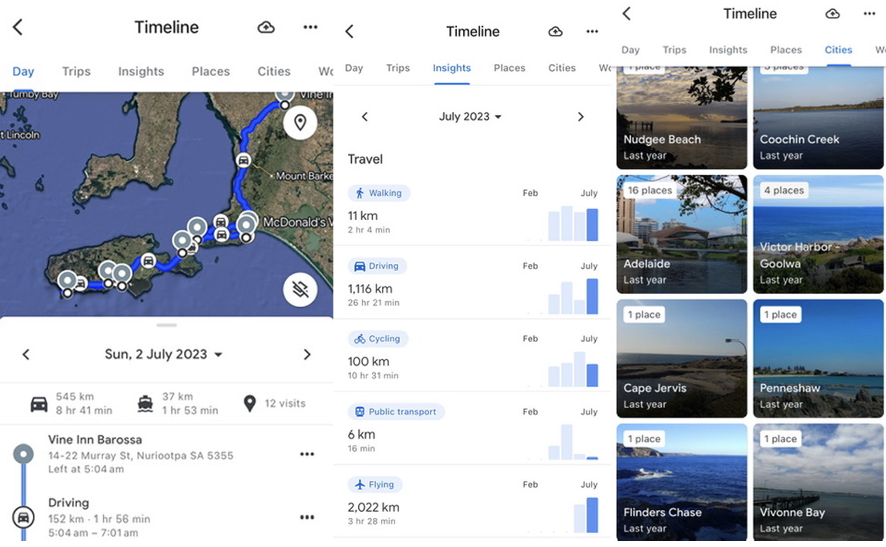

05/10/2024

Google Timelines is a feature within the Google Maps mobile app and tracks the day of the user, provides insights into monthly travel patterns and exercise, as well as letting you view and edit travel history. Integration with Google Photos also allows users to view a detailed timeline of a day with reference to photos and notes from that day and location of origin, allowing for a detailed and time based journal entries. Some additional background information is that as a hobbyist photographer and outdoors traveler I had used Google Timelines for a couple of years for the reasons stated earlier in the design purpose and my experience from a user perspective of Google Timelines and some of the other solutions is a major part of why this project is being constructed and this experience will be used to find what features can be used as inspiration and what to avoid in the final proposal through SWOT analysis to ensure that user wants and needs are addressed effectively.

<strong> Strengths ✅ </strong>- Google Maps is a free service only requiring a Google account. Great accuracy for road trips with GPS tracking and easily integrates with other Google services such as Google Photos. Application offers wide range of functionality.

<strong> Weaknesses ❌ </strong>- Google recently rolled out an update which ended support for Google Timelines online and now only stores information locally for security concerns. This change eliminated cross functionality across devices and made recorded statistics and travel journeys inaccurate. Another weakness here in response to the tasks design purpose is that this apps features are not dedicated towards the intended audience which this task is aiming for which creates an opportunity to design an app with this focus.

<strong> Opportunities 🧭 </strong>- Google does offer the API of their mapping services for third party use. A timeline like recording where a day entry for a journal is sorted by hour or in order can create a detailed journal entry and offer interactiveness to the user when expanded on. This project can offer grouped insights as seen in the image above to display a summary of activities recorded in the journal.

<strong> Threats ⚠️ </strong>- An inherent threat which would be consistent among all these solutions is recording of sensitive data regarding the users location and daily activities which must be protected when sent and stored. An option for local storage only could be provided to users.

***
### Existing Solution 2: Strava ###

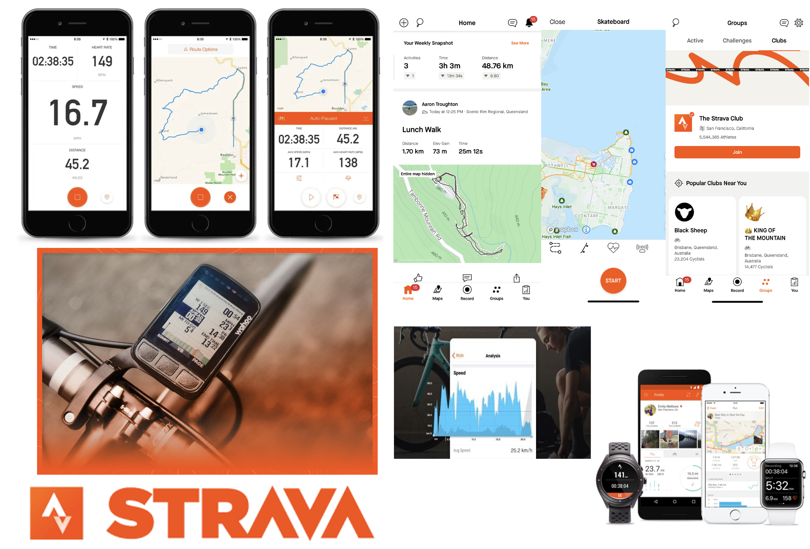

<strong> Strengths ✅ </strong>- Strava is the premier app when it comes to recording and tracking any outdoor based activity whether it be biking, walking, kayaking, swimming, skiing, it records all data and offers the millions of users insights into their performance and hobby activities. Satellite geolocation tracking to work even in the most remote places. Is available on all platforms and syncs across devices. Generates routes and activities for you. Works with many popular accessories and health apps. Customisable map interface using Mapbox API. Free app to install and use with premium plans available. Can join clubs and compete in challenges.

<strong> Weaknesses ❌ </strong>- Only in the context of this task is it a weakness but Strava acts as more of a social media platform where you share your trips with others and can compare performances and times with one another. In this projects use case of a private journal for self reflection, the concept of this apps functionalities will be utilised but with an app centred around single user without the social aspect which leads to the opportunities.

<strong> Opportunities 🧭 </strong>- In comparison to the Google Maps API from the prior example, the Mapbox API is much more accessible while offering a wide range of map customisation on a free plan with a 50,000 request limits which will work for this task. Incorporating a feature to link images to a certain time and location period to achieve the goal of being context aware and responsive.

<strong> Threats ⚠️ </strong>- Account security. If the project is aimed to work across devices, data must be managed securely and appropriately.

***
### Existing Solution 3: Apple Journals ###

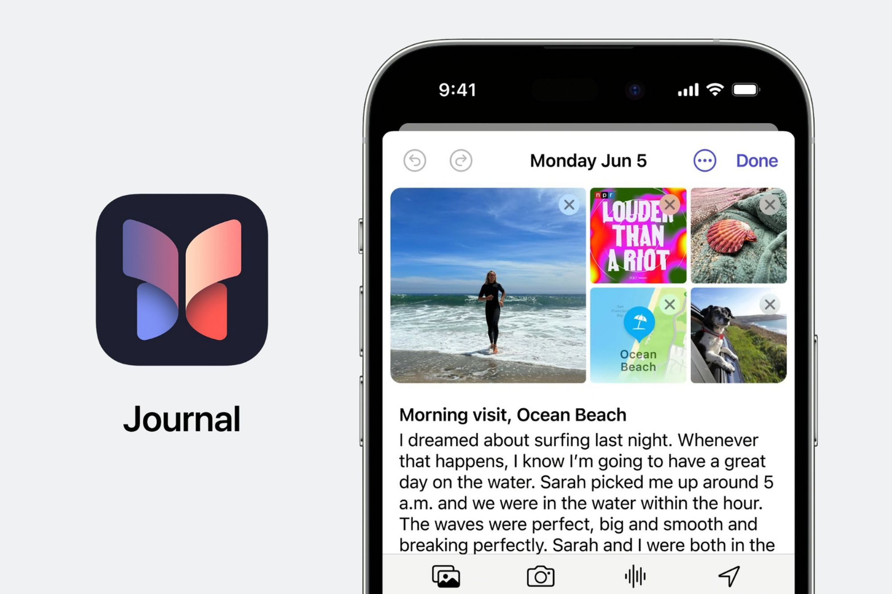

<strong> Strengths ✅ </strong>- Apple launched their official journal app December 2023. It is simplistic, clutter free and easily understandable offering the fundamental features such as date, text, photos, point location, voice over and music. This closely aligns with the concept of a scrapbook from the collage earlier. Saved entries are protected and made to be private to create an environment best for self-reflection.

<strong> Weaknesses ❌ </strong>- Main weakness is that this is limited to users in Apple's ecosystem only which is limiting the reach of the application. The goal of this task to create a journal application to record your movement throughout the day which would require functionality from the previous two examples to be added with the concept of a journal seen here. This will be explored more in the DEFINE stage of the double diamond and later in SCAMPER.

<strong> Opportunities 🧭 </strong>- Incorporating the feature to sort and filter entries as seen in Apple Journals will add interactiveness and reduce clutter in the proposed project. Daily notifications to enter in the journal could be an option provided but by default would need to be disabled to adhere to the task's theme of disconnection.

<strong> Threats ⚠️ </strong>- Unlike the other solutions, this application is highly secure making the only real risk of backing up data to prevent data loss.

***
### Existing Solution 4: Project Life ###

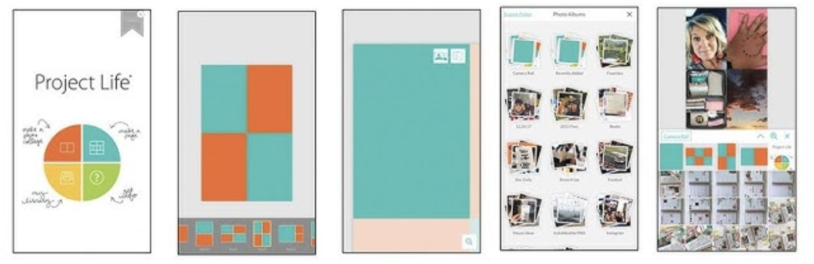

<strong> Strengths ✅ </strong>- Project Life is a completely free app from Becky Higgins made to create digital scrapbooks easily and is used as a teaching tool in primary school education. Offers an easy to use tool to journal in the form of visual imagery. App is intended to easily export digital scrapbooks and journals in a physical format, creating an engaging experience for the users.

<strong> Weaknesses ❌ </strong>- Cannot save work to come back to later and does not offer much flexibility when it comes to what is able to be inserted into the scrapbook or journal. Offers a tool rather than an experience which in the case of this project does not satisfy the task goal. What is normally basic functionality such as font selection are blocked by a pay barrier.

<strong> Opportunities 🧭 </strong>- The option to offer various different formats for pages is an interesting concept to explore. This allows for some individuality between entries and can have different pages formatted in a way which best reflects the user's day.

<strong> Threats ⚠️ </strong>- As listed in the weaknesses, not being able to save progress makes losing work a high risk.

***
### Existing Solution 5: Hiker's Logbook ###

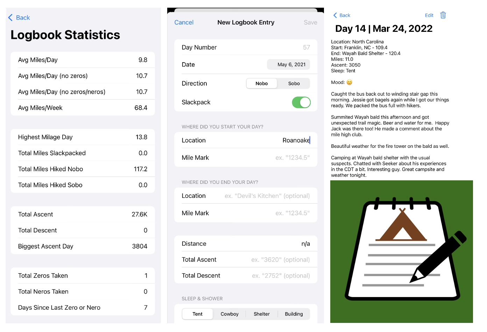

User discussion [HERE](https://www.reddit.com/r/Ultralight/comments/118cmky/hikers_logbook_an_ultralight_journal_app/) displays the target audience and the intended use case of the task's responsive application. 

<em> "I wanted to keep a daily journal of my mileage, major events of the day, and where I slept just to create some anchors to allow me to remember the day in the future."</em>

<strong> Strengths ✅ </strong>- This app was independently made by a hobbyist Aaron Byers non for profit to allow for an extremely light weight and easy to understand application which offers all statistics regarding hiking trips while offering the ability to take notes and journal each trip to look back on. This example is the closest at achieving the concept of journaling trips through location which is sought after in this task. Works offline without functionality loss. No account needed and is completely free to use.

<strong> Weaknesses ❌ </strong>- Is only available on iPhone devices which limits accessibility. This app is intended for hiking only but this must be expanded in the app being designed to support a wide range of hobbies. Uses manual input coordinates which is good for completely offline usage but a map API like Mapbox will need to be used in the tasks revisions.

<strong> Opportunities 🧭 </strong>- The minimalistic design and list display will be the ideal direction the UI will take. This will be explored further in low fidelity diagrams and in Figma prototypes further on in the journal. Each journal entry can have two sides like seen here, one with the trip data, mapping information, and photos with the other side of the entry being the reflection.

<strong> Threats ⚠️ </strong>- Is a individually made app and is not regularly supported.

***
### Existing Solution 6: Remerkable Paper Pro ###

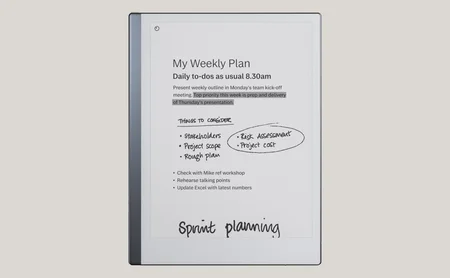

<strong> Strengths ✅ </strong>- Digitises the paper journaling experience without loosing the authentic feel of writing on paper. The lightweight, colourful, E Ink tablet with local encryption and cross platform capability allows for a quality built smart device to journal notes in but without the distractions of everyday smartphones. Paper like feel is achieved through a textured surface to enhance the journaling experience on the go. Is designed solely for writing which allows for an unmatched journaling experience. A pen to write along with shapes and unlimited media support allows for endless customisation in journal entries.

<strong> Weaknesses ❌ </strong>- High price barrier unlike the previous existing solutions. Ability to back up documents is another seperate subscription. Fragile device would not be ideal for the rougher, outdoor activities which this tasks intends to journal.

<strong> Opportunities 🧭 </strong>- The other solutions looks at a service/application approach to the task goal but this offers a look into how hardware can be utilised for the same goal. As determined early in this tasks' journal, context aware software such as strava and timelines would most likely be the approach taken, but dedicated hardware to expand of the softwares impact towards the task rationale can be designed in future advancements of this idea.

<strong> Threats ⚠️ </strong>- Fragile and slim form factor makes the device easy to damage and misplace.

Another relevant concept is nature journaling as seen in this video

[https://www.youtube.com/watch?v=o3pEY-qTBc8&ab_channel=Liberty%27sLibrary](https://www.youtube.com/watch?v=o3pEY-qTBc8&ab_channel=Liberty%27sLibrary)

The goal of this task is to provide the ability to journal a wide range different input such as plain text, images, and geolocation to allow for the user to create a journal in a way which allows them to best reflect what is being journaled and support any emotion and meaning behind the text. These 6 existing services and products explored displayed functions from differing apps with unique use cases and as identified, this task is aiming to utilise some of the core functionality seen across these examples to build an app which satisfies the task goal of connecting with the outdoors, traveling, and self reflection through an engaging and customisable journal application while employing geolocation API's to be accurately context-aware. Inspiration to achieve this goal can be visualised further in the Venn diagram below

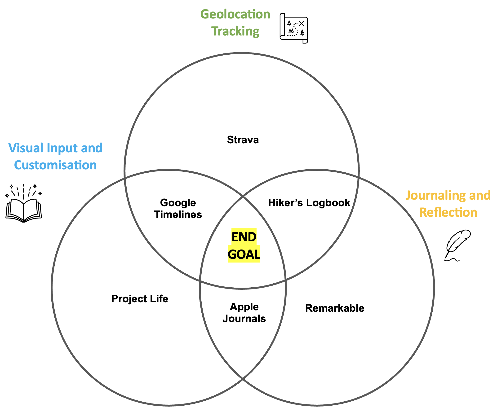

***
## 1.4	Early Concepts ##
06/10/2024

Reviewing and evaluating existing solutions allowed for the task to define what is expected to be seen in the early concepts and final development. To further advance in the define stage of the double diamond and more towards to development of the application, three revisions and application diagrams will be produced to see how effective the proposed solutions are at achieving the task goal.

### Realisation 1: Trek - A Journey Tracker Journal Application ###

This application is inspired by the geolocation and time based activity tracking seen in the Google timelines features and Strava app but would be dedicated for journaling and self-reflection. The goal here is to create a digital journal that captures not just thoughts and feelings but also the context of where and when those experiences occurred. This allows users to revisit their memories in a more immersive and meaningful way. This mode would allow users to not only log individual entries but also create continuous, chronological records of their journeys through an interactive map that displays the user's route with markers for each journal entry. The name 'Trek' was chosen as it means to perform a long and sometimes difficult journey which reflects what this app is trying to capture through journal entries.

<strong>Features include</strong>

• The ability to add photos, notes, and even short audio recordings to each point on the timeline.

• Timeline view that allows users to scroll through their journey chronologically, with entries displayed alongside the map.

• Group and filter entries

• View travel history through an engaging and minimalistic interface

• Creation of context awareness through the usage of the MapBoxes API and Media Capture API

<strong>Pros</strong>

Conceptually combines the core functionality from the reviewed existing solutions to achieve the goal seen in the Venn diagram. Displaying daily events paired with an interactive map to show the days events in chronological order allow for a rich and immersive form or journaling unseen in traditional forms. The extensive amount of information available to the user allows for deeper contextualisation by linking location to time to gain an understanding of how their environment and activities can influence their thoughts and feelings.

<strong>Cons</strong>

In contrast to the benefits seen in the lightweight nature of the Hiker's Logbook application, this apps wide range of tracking and functionality may pose a threat of being overly complex and may go against the goal of achieving minimalism, preserving the authentic feel of journaling and spending less time on technology. A lot of consideration must be put on designing the user interface to not overwhelm and stress the user with special focus to human, cultural, and social factors.

#### Trek Home Page GUI ####

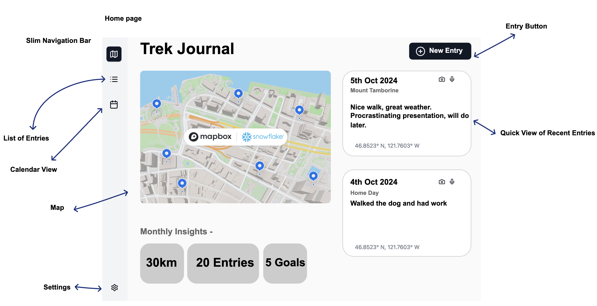

This low fidelity GUI prototype made in Pencil displays what the home screen of the Trek application could envision to adhere to the goal of being minimal.

***
### Realisation 2: Hue - A Mood Tracker using Microbits ###

This potential project direction utilises Micro:bit hardware with an application to capture and visualise the user's mood throughout their daily journey. This could be achieved by using the broad range of Micro:bit's compatible sensors of accelerometers, light sensors, and buttons to detect environmental changes, and manual input such as mood level. This idea branches away from the geolocation concept to focus on how other forms of being context-aware can be incorporated in this task. Acts as an emotional journal with the Micro:bit asking how was the day on the LED screen and results with the user selecting a response e.g., happy, sad, excited. The app communicates with the Micro:bit and allows the user to  journal that day in greater detail and add further context to what the Micro:bit has collected. This application also stores and lets the user revisit previous entries.

<strong>Pros</strong>

Interactive physical product to creating an engaging and simple platform for self reflection. Can make use of a wide range of sensors to add in the moment data to journal entries. Quick and easy action to journal with a press of a button which links back to the goal of disconnection.

<strong>Cons</strong>

Is overly simplified and offers less function in comparison to the other solutions. The form factor of a Micro:bit and loose parts may be an issue to travel with and will need further design put on casing. Hard to journal in detail on the go with the limited input options of a Micro:bit. Relies on battery life. Offers a lot less flexibility than a software based solution such as seen in realisation 1.

#### Microbit Foundation Block Code ####

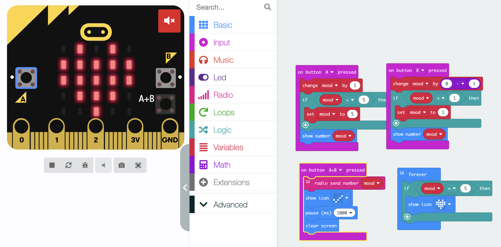

The above Micro:bit block code is a draft of how hardware can be used to journal emotion. The above lets the user select an input ranging from 1-5 on how they are feeling. This displays the core idea behind this realisation and would need to be extended to word with different sensors and implement communication with an application to properly document journal entries in order to achieve the task goal.

***
### Realisation 3: Quests - Making Journaling into a Game ###

This third idea is exploring the engagement aspect sought after in this project. This would be an application which turns journaling into a game by rewarding the user when journaling. This is done through random daily quests which are given to the user such as 'walk 1km' or 'journal for 3 straight days' to unlock achievements. Data collected while journaling can provide useful insights into the user's well-being and lifestyle patterns to generate personalised recommendations for further exploration or self-improvement. This aims to satisfy the task rationale of encouraging users to explore the outdoors to improve wellbeing with the assistance of this application.

<strong>Pros</strong>

Increased engagement and habit formation through daily quests to encourage journaling. Implements motivation and goal setting for long term goals set by either the user or application. App can provide a personalised experience based on user input and user activity. Encourages exploration of outdoors and physical activity through a simple user interface while providing back a sense of accomplishment.

<strong>Cons</strong>

Users may become overly focused on earning rewards rather than the intrinsic value of journaling and self-reflection which takes away from the purpose of which this task is trying to achieve to offer an app/environment for genuine reflection and an authentic journaling experience. A game like experience may not be effective for all users with some users  finding it as a distracting or demotivating form of journaling. A personalised experience is a critical feature, but is also complex to design and create in comparison to the other realisations.

#### Quest Low Fidelity Home Page ####

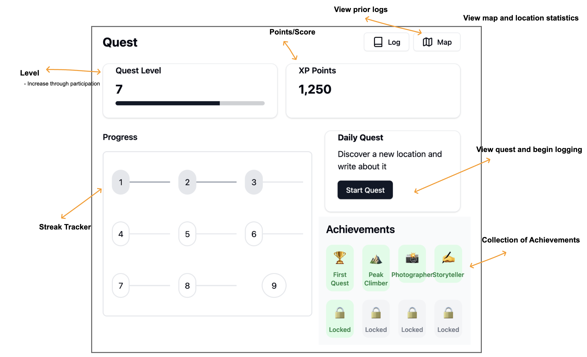

The UI designed in Pencil shows the home page with buttons to direct the user to the various functions that the application offers. This includes logging history, a map view, journaling streak, account level and daily quest information. This proposal combines journaling with the experience of a game to offer a new form to journaling.

***

### Realisation Findings ###
The three realisations formed reveal a unique and interesting way in response to the task project designing a location-based diary application. These solutions will be evaluated against the tasks goal, rationale and purpose as well as through the consideration of human, and social aspects to see how user's are affected, and with further review into the complexity and effectiveness of the application to see if it suits the time constraints of this project.

<strong>Reminder Checklist</strong>

<ins>Purpose</ins>- To create a context-aware web application that enhances user experience through responsiveness and innovation.

<ins>Rationale</ins>- To support a healthier relationship with technology in everyday life. This involves promoting digital wellbeing, mindfulness, and moment awareness through the app's design and functionality. The app should encourage users to connect with their surroundings and reflect on their experiences

<ins>Goal</ins>- To develop a responsive application that allows users to record and reflect on their experiences in a meaningful way.

• Location tracking and mapping

• Context-awareness

• Responsive and accessible on a wide range of devices

• Journal entries with text, images, and timestamps
    
• Timeline view of entries

<strong><ins>Realisation 1 of the 'Trek' application is selected</ins></strong> as the most appropriate for to be continued throughout this projects design process due to the idea being the best at balancing all the features requested and best suits the mid point of the Venn diagram from earlier. The combination and support of multiple media formats would allow Trek to be best at satisfying the core requirement needs stated in the goals list above. The minimalistic UI proposed in the low fidelity GUI aims to fulfil the goal of a lightweight and understandable aesthetic to promote physical exploration and journaling to promote improved well-being. This user interface complements the user experience to create a design which is centred around the human wants and needs of the user by creating a space for self-reflection while preserving the authentic journal and scrapbook experience, which is highly beneficial to the user. Trek pleases social and cultural factors through mindful engagement with technology to effectively connect with the real world in the trend of digital detox while catering to the human need for belonging and connection with private entries to look back on.

***
## 1.5	Development of Selected Concept ##

The Trek application will be further developed in accordance with the double diamond model. The end of section 1.4 clearly defined what is expected and will be used as the criteria for effectiveness throughout the development stage going forward. 

Although this application is designed to be a cross platform service, the initial test versions from this development will be made as a web app with HTML, CSS, and JavaScript to test the concept before designing specially for various platforms. Feedback from prior tasks will be utilised in the development later on, suggesting to use CSS Grids and flex boxes to achieve responsiveness in adjusting to varying screen sizes. The core functionality and application concept were planned on the sitemap below to draft how the pages will link with one another.

#### Sitemap ####

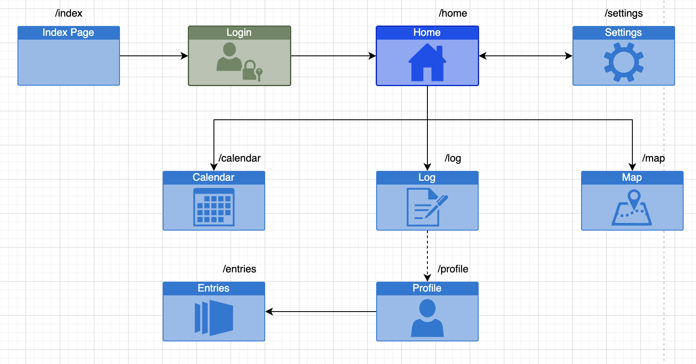

The web application is designed with hierarchy as the various core functionalities branch from the central home page which can quickly access all areas of the application. Research from the existing application Strava determined that the Mapbox API is best suited for geolocation features in this task which will support additional input from the universal RESTful and media capture APIs. The home page would have summaries from the main features, as inspired from the UI in realisation 1, with links to a calendar to view all entries through either a calendar or list view. Additional features that can be present here is being able to group, filter or search through entries. The map page displays the interactive map from Mapbox and is used to plan out journeys. The log page is the central function which lets the user input text and start recording their day. The Google Timelines feature inspires another possible which would be to automatically record the day in the background and then the log page is used to add context to this information and sort the day as a detailed timeline. These pages will now be drafted on Figma to test the aesthetic choices of the user interface as well as responsiveness and feature implementation in greater detail from the low fidelity GUIs.

07/10/2024

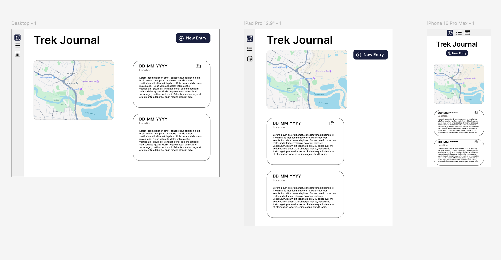

The design choices from the initial UI aesthetic were kept in the Figma design but how the grid will need to adjust to different screen sizes were planned here for responsiveness across tablets and phones. Here the goal of being both lightweight and informative is achieved and will be unchanged going forward. Although this visualises only what the home page will look like so another UI was designed regarding the logging page.


This HTML file displays an interactive timeline made with CSS and JavaScript connecting to events. The idea from earlier about having two sides to a journal entry of part scrapbook and part map were incorporated here. These flex boxes and shapes are for the moment place holder information. This page in future development requires functionality to POST and GET information through REST API to display and store the entries that the user inputs. 

This idea will now be delivered as a presentation to gather feedback before the development of a fully programmed web application begins as the end of the define stage of the double diamond methodology nears.


***
## 2	Front End Programming ##

06/11/2024

The development of the Trek realisation will be done seperated into three steps to be done in order being

1. Designing a responsive HTML template

2. Incorprating API and front end functionality

3. Back end, sever support and launch

These steps give an order of goals to achieve before shifting the development process to ensure the foundations are executed well to support further development. This was clear from the early prototypes from the conceptualisation stage of this project and prior unrelated projects (Task 1) where challenges arose in creating a responsive web template which can adjust to a change in screen size while maintaining a consistant user interface. The Figma GUIs from section 1.5 of the journal where used as inspiration to create HTML and CSS files with a sole focus on design without planning for functionality.

## 2.1	Home Page Layout ##

Feedback from prior projects insisted using flexible grid containers with the contents inside being set to take 100% width, which as seen in the image above was highly effective in adjusting to a change in screen size. The blank space will be where a map is displayed with the text boxes displaying recent activity which for now store placeholder text to test how the concept can be displayed. This is the I index/home page where it holds a summary of all functionality and information while maintaining the minimalistic aesthetic aimed for in the conceptualisation research.

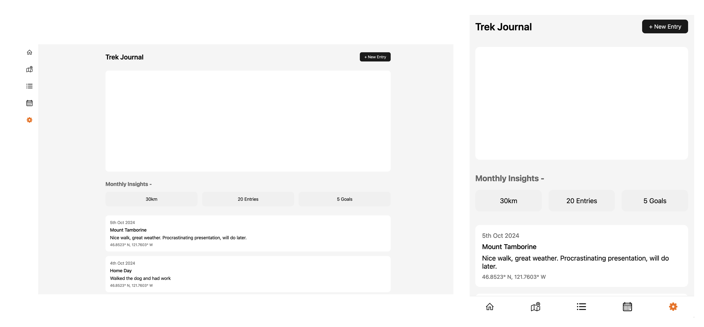

This sketch over the index HTML image visualises the grid containers in the red rectangles. The drawn blue lines is the changes needed to get the desired boxes seen in the figma design. This will require the creation of 3 smaller grid boxes in this division.

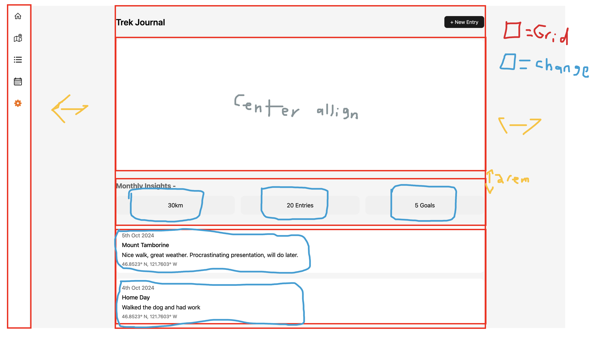

A map was designed in Mapbox Studio to be displayed in the blank placeholder space in the home page. This map is purely to display the users location and isn't where the journaling occurs. Initaly a monochrome map with use of serif fonts was decided to achieve that aesthetic of a map a reader would see in a novel and enhance that disconnection experience with the minimal usage of colours.

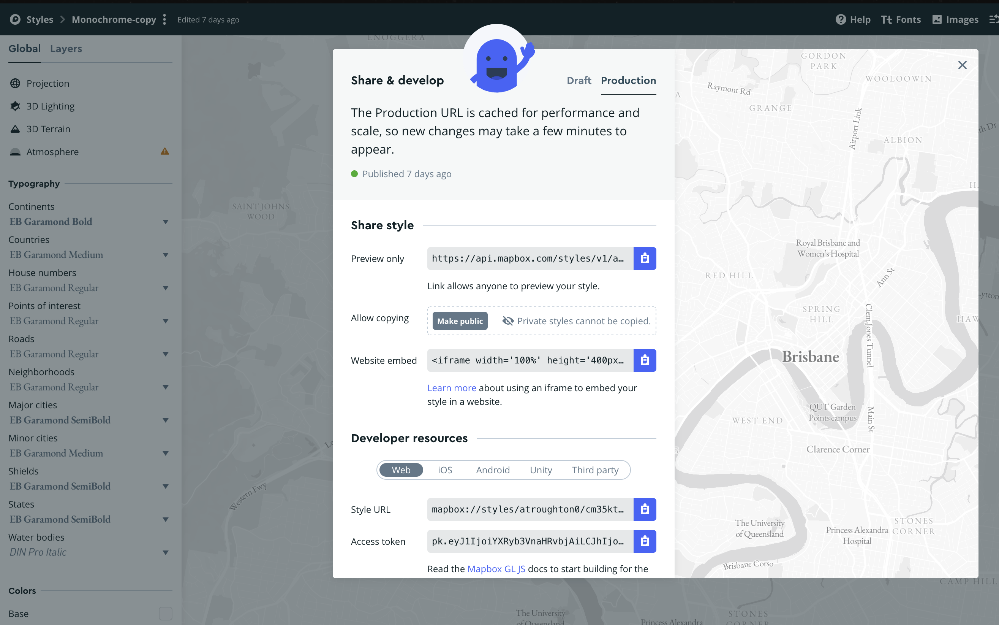

A tokenid and style link was generated which allows the custom map and api functionality to be incorprated in the application. The image bellow displays the first test of using mapbox api in Trek.

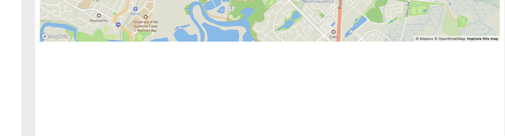

A single CSS file was made rather than using style tags in the html files for greater organisation throughout the repistitory and allowed for easier throubleshooting.
This was fixed with the following CSS

```
.map-section {
    display: flex;
    flex-direction: column;
    gap: 16px;
    margin-bottom: 2rem;
}
```

```
.map-container {
    background-color: #ffffff;
    border-radius: 12px; /* White boarder around map for a more tidy user interface*/
    padding: 1%;
    height: 400px; /* Width uses 100% of map-section and flexes with it*/
    overflow: hidden;
    position: relative; /* Respond with flexing section which the map is inside*/
}
```

```
@media (max-width: 768px) { /* When width is less than 768px then update classes*/
    .app-container { /* App container encompassing everything but the nav*/
        grid-template-columns: 1fr;
    }

    .nav-sidebar { /* Nav bar becomes horizontal and is placed at the bottom of the screen*/
        position: fixed;
        bottom: 0;
        left: 0;
        width: 100%;
        height: 60px;
        flex-direction: row;
        justify-content: space-around;
        padding: 0.5rem;
        border-top: 1px solid #eaeaea;
        background-color: #ffffff;
        z-index: 1000; /* Is layered in front of everything through the z axis*/
    }

    .main-content {
        padding: 1rem;
        padding-bottom: 70px;
    }
}
```

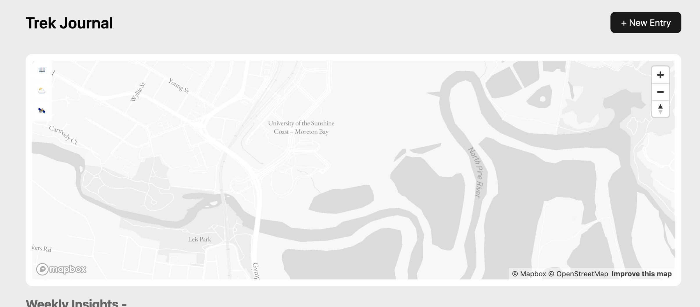

```
mapboxgl.accessToken = 'pk.eyJ1IjoiYXRyb3VnaHRvbjAiLCJhIjoiY20ydTVobzk2MDZ4aTJxcG52ZWVmbTVoayJ9.0-MtCojihJsfD5HW-1Z7jw';
                    const map = new mapboxgl.Map({
                        container: 'map',
                        style: 'mapbox://styles/atroughton0/cm35kt3c900zb01pwgl3qbkz7',
                        zoom: 14
                    });
```

2 other Map styles and controls were added from the Mapbox API documentation (https://docs.mapbox.com/api/overview/) as the bright white map is not for best use practicaly. Added was an outdoor map which highlights different landscapes and the classic satelite view to add further engagement.


## 2.2	Designing the Journaling User Interface ##
Trek is intended to be a multipurpose and adaptable journaling application and therefore must be able to accept journal entries wheather they have geolocation data or not. This will be split into two html pages with one recording coordinate journies while the other page does the text input. As a map is the core function here, I tried to recycle code from the index html page and see what can be reused and modified.

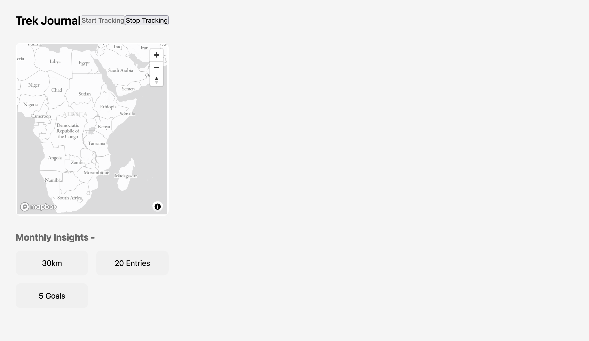

The desired layout for this page would be maily ocupied by the map and have buttons to start, stop, and potentialy drop markers down to refer to in later text journaling. This is a very basic design but highly effective at only giving the user the essential information which is required as conveyed in our goal for disconnection. The map-containers and map-section style classes in the CSS were adjusted to achieve this with two buttons made. All that is required is creating JavaScript utalising html geolocation module to gather, display and send geolocation data. The outdoor style is set to default in this section over the monochrome design.

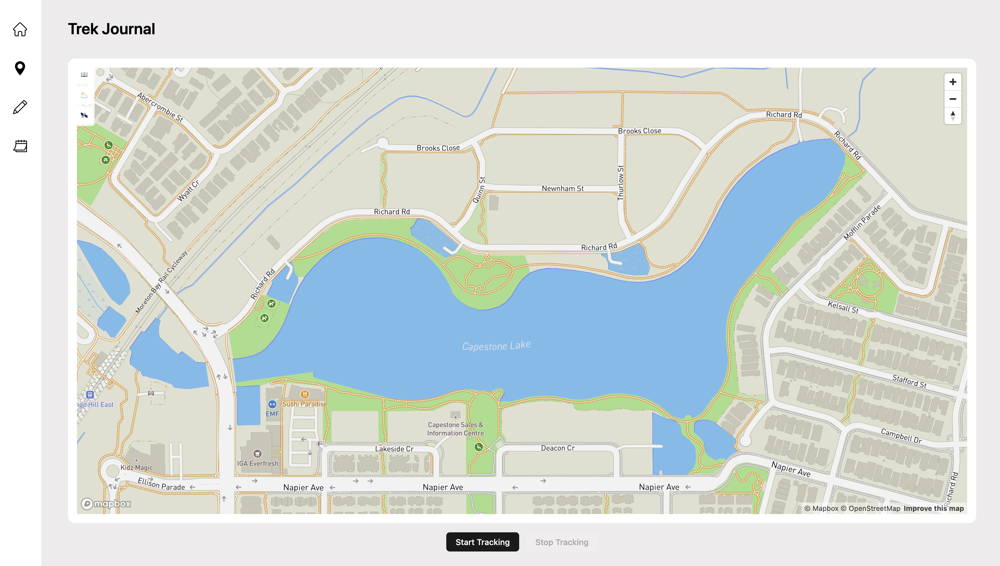

```
                let tripCoordinates = []; // Array starts as empty
                let tripActive = false; //Recording is off by default

                // Function to start recording the trip
                function startTrip() { //defining the function of starting a trip and what is then performed
                    tripActive = true; //recording becomes true
                    tripCoordinates = [];
                    if (navigator.geolocation) {
                        navigator.geolocation.watchPosition(recordLocation, showError, { enableHighAccuracy: true }); //watch position notes the users position overtime with high accuracy on
                    }
                    alert("Trip recording started."); // popup message to alert the user
                }
```

```
                    function recordLocation(position) { //function to record position
                    if (tripActive) { //if trip is being recorded
                        const currentLocation = [position.coords.longitude, position.coords.latitude]; //find coordinates to define user location
                        tripCoordinates.push(currentLocation);

                        // Update map with trip path and draw visable line of the journey using tripCoordinates dictionary
                        map.getSource('tripLine').setData({
                            "type": "FeatureCollection",
                            "features": [{
                                "type": "Feature",
                                "geometry": {
                                    "type": "LineString",
                                    "coordinates": tripCoordinates
                                }
                            }]
                        });
                    }
                }
```

```
function stopTrip() {
                    tripActive = false; // when trip is stopped
                    alert("Trip recording stopped."); // alert the user
                    console.log("Recorded Trip:", tripCoordinates); // send journey coordinates to the console log as saving requires backend
                }
```

For now this collected the coordinates of a users journey and saved it to tripCoordinates which is then used to draw the journey and is sent to the console log. In a finalised version with a backend to manage data, this would send the data through restful api to be saved and used in other pages such as the log.html

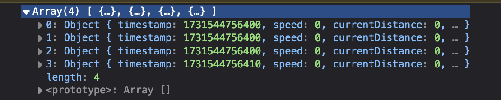

08/11/2024

The next aspect to journaling is text input. This would have the user select a date, write a description and upload an image if they wanted to. This date will be used as a value to connect to trip journaling is a date is shared. This would be done in python but for now only the user interface was being designed at the current stage.


